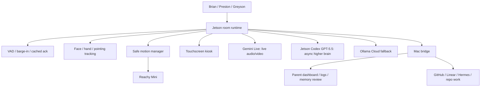

# Reachy Jetson Existing Setups Research

Date: 2026-04-25

This is the stack audit for the current "we have a bunch of stuff" moment. It
compares what NVIDIA/Pollen/Hugging Face are already doing with Reachy Mini,
what is actually running on our Jetson, and what we should copy or avoid.

## Short Decision

Use the Jetson as the minimal in-room robot appliance, not as the main local AI
supercomputer.

Recommended room shape:

- Jetson always-on: wake/listen, VAD, cached acknowledgement, audio device
  control, camera sampling, face/hand/pointing tracking, attention state,
  safe motion, emotion/dance playback, touchscreen kiosk, event spool.
- Jetson direct cloud: Gemini Live for live audio/video, Codex/GPT-5.5 for
  async higher-brain tasks, Ollama Cloud only as fallback/experiment.
- Mac mini: parent dashboards, Hermes, GitHub/Linear, canonical repo edits,
  reports, logs/replay, config, artifact mirror, non-realtime tools.
- Local Jetson LLM/VLM: optional scheduled diagnostic/fallback only until it
  earns its RAM beside speech, tracking, camera, and motion.

The best pieces to copy are not the biggest model recipes. They are the motion
manager, app packaging, event bus, health checks, and recorded motion assets.

## What Is On Our Jetson Right Now

Live board check on 2026-04-25:

- Host reachable over USB at `192.168.55.1`; mDNS names like `jetson.local`
  are currently not reliable.
- Jetson RAM: `7.4 GiB` total, about `3.7 GiB` available with local Gemma hot.
- `assistant-llm` / `llama-server` is the big resident load:
  `3.796 GiB / 7.441 GiB`, about half the board memory.
- The local project is a dirty clone of
  `NVIDIA-AI-IOT/reachy-mini-jetson-assistant`.
- Current local changes include Mac bridge, resource policy, latency probes,
  memory docs, and escalation scripts.
- Codex CLI is installed and logged in with ChatGPT on the Jetson.
- Latest direct Codex benchmark:
  - Mac `model_reasoning_effort=none`: `7.853 s`
  - Jetson `model_reasoning_effort=none`: `5.003 s`
  - Mac `model_reasoning_effort=low`: `7.137 s`
  - Jetson `model_reasoning_effort=low`: `6.045 s`

Interpretation: direct Jetson Codex is a little faster than the Mac path in
this run and is low-memory, but it is still a multi-second async lane. It does
not belong in first-audio.

## NVIDIA Jetson Assistant Demo

Reference:
`NVIDIA-AI-IOT/reachy-mini-jetson-assistant`.

The official Jetson assistant is a fully local demo for Jetson Orin Nano 8GB:

```text
Reachy mic -> Silero VAD -> faster-whisper STT
Reachy camera -> OpenCV/V4L2 ring buffer
STT + frames -> llama.cpp VLM/LLM
LLM stream -> Kokoro TTS -> Reachy speaker + motion
Web UI -> FastAPI/WebSocket stats and camera
```

Components:

- VLM: `llama.cpp` Docker server, OpenAI-compatible API,
  Cosmos-Reason2-2B GGUF Q4.
- Text LLM: Gemma 3 1B Q8 for text-only mode.
- STT: `faster-whisper` with CUDA-built CTranslate2; default is English-only
  `small.en`.
- TTS: Kokoro ONNX in a subprocess.
- VAD: Silero VAD.
- Vision: OpenCV/V4L2, 3 fps ring buffer for model calls, separate faster UI
  stream.
- Robot: Reachy Mini SDK over USB.
- UI: FastAPI + WebSocket dashboard.
- Optional RAG: ChromaDB + bge-small embeddings.

What to copy:

- Separate model server from robot orchestration.
- OpenAI-compatible local model boundary.
- `settings.yaml`-driven config.
- `ReachyMini(media_backend="no_media")` when custom OpenCV/audio needs direct
  hardware access.
- VAD lookback/silence thresholds.
- Camera ring buffer; model FPS lower than UI FPS.
- Streaming LLM output into a TTS queue.
- TTS subprocess isolation.
- Reachy daemon cleanup/wake/sleep handling.
- Built-in diagnostics for camera, mic, CUDA, RAM, swap, and model server.

What not to copy as our product architecture:

- Keeping local Gemma/VLM hot while also trying to run STT, TTS, camera,
  tracking, and motion on an 8 GB board.
- English-only Whisper as the family default.
- Assuming "fully local" is the goal when latency and Spanish/code-switch
  quality are the real goals.
- Building everything inside the upstream vendor demo clone.

The Jetson assistant proves the board can run a trimmed local demo. It does not
prove it should be the full family robot brain.

## DGX Spark Reachy Demo

There is a separate NVIDIA/Hugging Face Reachy Mini demo for DGX Spark. It is
not the same hardware class as our Jetson Orin Nano.

DGX Spark has `128 GB` unified memory and is positioned by NVIDIA as a desktop
AI supercomputer for local agentic/physical AI work. The Spark + Reachy photo
booth playbook runs many heavyweight local services:

- NeMo Agent Toolkit / ReAct agent.
- `openai/gpt-oss-20b` via TensorRT-LLM.
- Riva/Parakeet speech-to-text.
- Kokoro text-to-speech.
- FLUX.1-Kontext image generation.
- Detectron2 + ByteTrack user tracking.
- Redpanda message bus.
- MinIO image storage and QR sharing.
- UI, metrics, robot controller, animation database/compositor services.

What to copy:

- Service boundaries.
- Message bus/event-driven architecture.
- Separate robot controller from agent/model services.
- Separate animation database and animation compositor.
- Metrics/observability from day one.
- Explicit local-network security warning.

What not to copy:

- Running DGX-scale services on the Jetson Orin Nano.
- Assuming local image generation/LLM/STT/TTS/tracking all fit on our 8 GB
  Jetson.
- Adding Redpanda/Grafana/Phoenix/MinIO complexity before our lean loop works.

For our current hardware, DGX Spark is a design reference, not a deployment
target. Our equivalent of "Spark compute" is cloud models plus the Mac
back-office, while the Jetson stays close to the robot body.

## Pollen / Hugging Face App Pattern

The strongest product-like base is
`pollen-robotics/reachy_mini_conversation_app`.

It uses:

- `fastrtc` for low-latency realtime voice.
- OpenAI Realtime by default, Gemini Live as an alternative.
- Camera tool calls that use the selected realtime backend or optional local
  SmolVLM2.
- Layered motion: queued primary moves plus speech wobble/head-tracking
  offsets.
- Tools for head movement, camera, head tracking, dance, stop dance, recorded
  emotion, stop emotion, and idle.
- Profile folders with instructions and allowed tools.
- Hugging Face Space tags: `reachy_mini` and `reachy_mini_python_app`.
- `reachy_mini_apps` Python entry point for installable apps.

This is closest to what we need for the family robot. We should use its shape,
but with our parent dashboard, memory approval, family profiles, and safety
policy.

Brian's fork has been created/confirmed:

- https://github.com/brianmeyer/reachy_mini_conversation_app

Local clone:

- `/Users/brianmeyer/reachy_mini_conversation_app`

See [Reachy Conversation App Fork Plan](reachy-conversation-app-fork-plan.md).

## Hugging Face Motion Assets

Use the official motion assets instead of inventing all movement from scratch:

- `pollen-robotics/reachy-mini-emotions-library`
  - 81 recorded emotion rows.
  - JSON timelines with `set_target_data`.
  - Audio/text metadata.
- `pollen-robotics/reachy-mini-dances-library`
  - 19 recorded dance rows.
  - JSON timelines and descriptions.
  - Good seed for "dance to music" and story performance.
- `reachy_mini_dances_library`
  - Python package for prebuilt dance moves and BPM/choreography support.

These should become local named motion assets behind our safety gate. Cloud
models may request `play_emotion:curious` or `dance:swing`, but they should not
emit raw motors.

## Hugging Face Speech / Vision Candidates

For Spanish/code-switch and low-memory local experiments:

- `nvidia/canary-180m-flash`: English, Spanish, German, French ASR/AST.
- `csukuangfj/sherpa-onnx-nemo-canary-180m-flash-en-es-de-fr-int8`: possible
  lighter ONNX/sherpa deployment path.
- `nvidia/parakeet-tdt-0.6b-v3`: multilingual ASR candidate, heavier.
- `HuggingFaceTB/SmolVLM2-500M-Video-Instruct`: local snapshot/video VLM
  candidate after the lean loop is healthy.
- `HuggingFaceTB/SmolVLM2-256M-Video-Instruct`: smaller local VLM candidate.

These are not default kid-path choices yet. They go into controlled benchmarks
with local Gemma off, memory/fragmentation logged, and English/Spanish/code-
switch samples.

## Direct Jetson Cloud Model Path

Direct Jetson cloud calls are worth keeping:

- Network connect checks from Jetson to Gemini/OpenAI/Ollama were sub-second.
- Jetson Codex/GPT-5.5 was faster than Mac Codex in the latest tiny prompt
  test, but still multi-second.
- Codex RAM is small compared with local Gemma. Latency is the problem, not
  memory.

Default routing:

- Gemini Live from Jetson for live audio/video sessions.
- Jetson Codex/GPT-5.5 for local touchscreen artifacts, story plans,
  diagnostics, and parent-approved async tasks.
- Ollama Cloud from Jetson only if we install/auth it there or proxy through
  the Mac; use it as fallback, not live audio/video.
- Mac bridge for parent/admin, logs, GitHub/Linear, Hermes, and repo work.

Latency policy:

- First audio target should be cached acknowledgement + local micro-motion,
  not a fresh LLM.
- Use `model_reasoning_effort="none"` only for tiny deterministic tasks after
  quality tests.
- Use `low` for normal async room tasks.
- Use `medium/high/xhigh` only for explicit deep planning/debugging.
- Stream text where possible so TTS/screen rendering can begin early.

## Cleanup Recommendation

Do not wipe the Jetson yet. Create clean ownership boundaries first:

1. Keep `/home/brianmeyer/reachy-mini-jetson-assistant` as upstream reference
   plus temporary patches.
2. Create a clean Reachy room runtime package or overlay that owns:
   - lean room mode
   - Gemini Live client
   - Codex async wrapper
   - event spool
   - motion assets
   - resource manager
3. Vendor or copy only the useful parts from NVIDIA/Pollen:
   - Reachy connect/daemon handling
   - media release/direct hardware access pattern
   - VAD/camera ring buffer
   - motion manager / recorded moves
   - health doctor
4. Archive generated health reports and stale artifacts; keep only latest
   summaries visible.
5. Disable `assistant-llm` by default for lean room mode.

## Better Architecture For Our Family Robot



The Jetson can be minimal and still feel alive if it owns timing, tracking,
motion, and screen. The "brain" can be piped through direct cloud calls, because
the visible responsiveness comes from local acknowledgement and choreography.

## Sources

- NVIDIA Reachy Mini Jetson Assistant:
  https://github.com/NVIDIA-AI-IOT/reachy-mini-jetson-assistant
- NVIDIA Jetson memory efficiency:
  https://developer.nvidia.com/blog/maximizing-memory-efficiency-to-run-bigger-models-on-nvidia-jetson/
- Spark & Reachy Photo Booth:
  https://build.nvidia.com/spark/spark-reachy-photo-booth
- NVIDIA Spark Reachy Photo Booth repo:
  https://github.com/NVIDIA/spark-reachy-photo-booth
- NVIDIA DGX Spark overview:
  https://nvidianews.nvidia.com/news/nvidia-dgx-spark-arrives-for-worlds-ai-developers/
- Hugging Face / NVIDIA Reachy Mini DGX Spark article:
  https://huggingface.co/blog/nvidia-reachy-mini
- Reachy Mini SDK:
  https://github.com/pollen-robotics/reachy_mini
- Reachy Mini media architecture:
  https://huggingface.co/docs/reachy_mini/en/SDK/media-architecture
- Reachy Mini conversation app:
  https://github.com/pollen-robotics/reachy_mini_conversation_app
- Reachy Mini app publishing:
  https://huggingface.co/blog/pollen-robotics/make-and-publish-your-reachy-mini-apps
- Reachy Mini emotions dataset:
  https://huggingface.co/datasets/pollen-robotics/reachy-mini-emotions-library
- Reachy Mini dances dataset:
  https://huggingface.co/datasets/pollen-robotics/reachy-mini-dances-library
- NVIDIA Canary 180M Flash:
  https://huggingface.co/nvidia/canary-180m-flash
- Sherpa ONNX Canary int8:
  https://huggingface.co/csukuangfj/sherpa-onnx-nemo-canary-180m-flash-en-es-de-fr-int8
- SmolVLM2 500M:
  https://huggingface.co/HuggingFaceTB/SmolVLM2-500M-Video-Instruct
